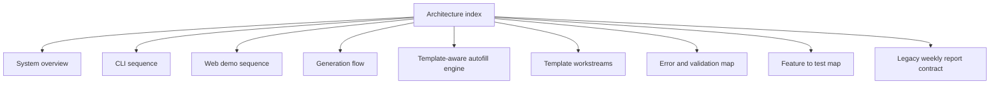

# Autoreport Architecture Docs

This folder documents the current `autoreport` core from a testing-first point of view.
It is meant to help contributors inspect the live design without relying on a GUI.

Start here when you need to understand how the current contract-first
Autoreport runtime is wired.
Read `template-aware-autofill-engine.md` or `system-overview.md` first, then
pick the sequence, flow, contract, or test map that matches the feature you are
touching.

## Document set

- `system-overview.md`: high-level component view of the current runtime path
- `cli-sequence.md`: end-to-end CLI generation path and failure mapping
- `web-demo-sequence.md`: browser-to-API generation path and HTTP outcomes
- `generation-flow.md`: data-shape transitions from YAML input to `.pptx`
- `template-aware-autofill-engine.md`: current contract-first template profiling, slot mapping, fitting, and diagnostics frame
- `template-workstreams.md`: branch plan and done criteria for versioned parallel template-engine work
- `error-and-validation-map.md`: shared failure boundaries and surface-specific responses
- `feature-test-map.md`: feature ownership mapped to current unittest modules
- `weekly-report-contract.md`: legacy migration note for the older weekly-only shape that still appears in some internal modules and docs

## Inspection points

- Treat repository code and tests as the source of truth when these docs drift.
- The current product has two public entry points, and both converge on the same deterministic generation core.
- The current public framing is template-contract-first Autoreport generation, not weekly-only reporting.
- `weekly-report-contract.md` should not be read as the current public product contract.
- `autorelease`, WordPress publishing, and private workflow steps are intentionally out of scope here.

## Source of truth

- `README.md`
- `pyproject.toml`
- `autoreport/cli.py`
- `autoreport/web/app.py`
- `tests/`
