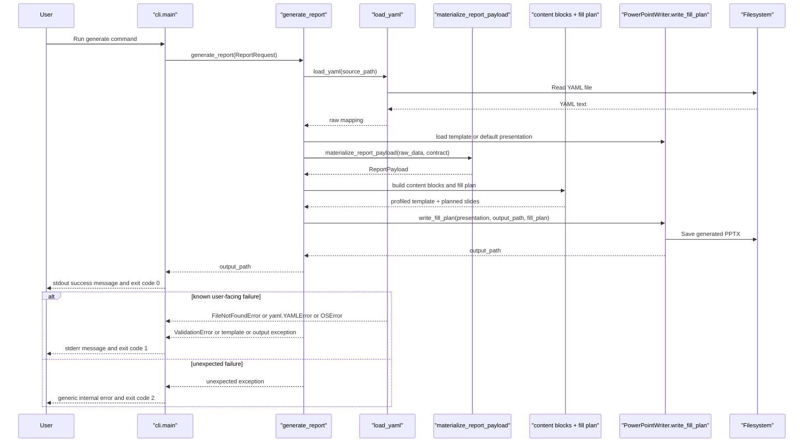

# CLI Sequence

This diagram shows the current happy path for `autoreport generate ...` plus the main user-visible failure buckets enforced by the CLI tests.

## CLI failure mapping

| Failure source | User-visible outcome |
| --- | --- |
| Missing report file | `Report file not found: ...` and exit `1` |
| YAML parse failure | `Failed to parse YAML: ...` and exit `1` |
| Validation failure | `Report validation failed.` plus one line per error and exit `1` |
| Missing template | `Template file not found: ...` and exit `1` |
| Invalid template file | `Invalid PowerPoint template file: ...` and exit `1` |
| Unreadable template file | `Could not read template file: ...` and exit `1` |
| Incompatible template | compatibility message and exit `1` |
| Output write failure | `Could not write report file: ...` and exit `1` |
| Unexpected exception | `An unexpected internal error occurred.` and exit `2` |

## Inspection points

- The CLI is responsible for argument parsing and failure-to-message mapping, not schema logic.
- `ReportRequest` carries `source_path`, optional `output_path`, optional `template_path`, and `template_name`.
- The default output path is `output/<source-stem>.pptx` when `--output` is omitted.
- Narrow CLI verification lives in `tests.test_cli`.

## Source of truth

- `autoreport/cli.py`
- `autoreport/models.py`
- `autoreport/engine/generator.py`
- `tests/test_cli.py`
