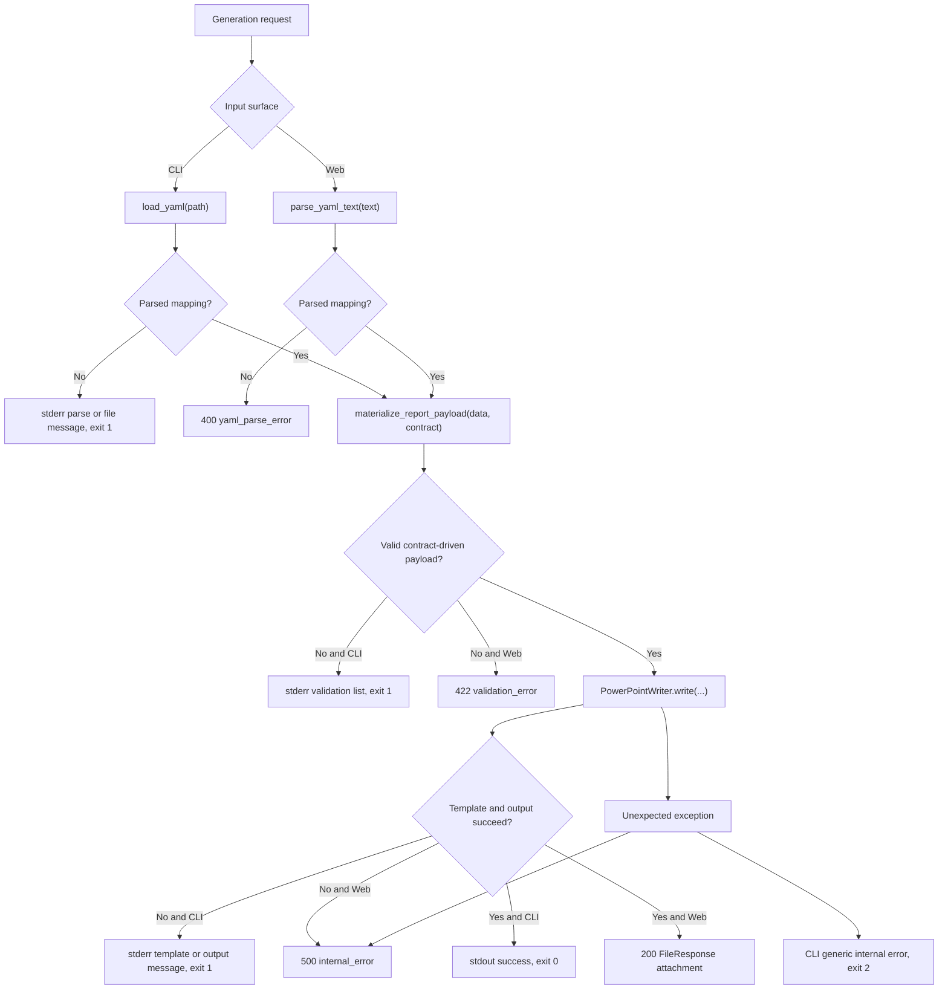

# Error And Validation Map

This document maps where failures are detected and how each public surface reports them.
Use it when you want to design feature-level checks without guessing which layer owns a problem.

## Surface outcomes

| Failure class | CLI outcome | Web outcome |
| --- | --- | --- |
| Missing report file | specific missing-file stderr, exit `1` | not applicable |
| YAML parse failure | parse stderr, exit `1` | `400` with `error_type=yaml_parse_error` |
| Validation failure | validation header plus error list, exit `1` | `422` with `error_type=validation_error` and `errors[]` |
| Missing template | template-not-found stderr, exit `1` | currently falls into `500` |
| Invalid template file | template-load stderr, exit `1` | currently falls into `500` |
| Unreadable template file | template-read stderr, exit `1` | currently falls into `500` |
| Incompatible template | compatibility stderr, exit `1` | currently falls into `500` |
| Output write failure | output-write stderr, exit `1` | currently falls into `500` |
| Unexpected internal error | generic stderr, exit `2` | `500` with `error_type=internal_error` |

## Validation checkpoints

- Top-level content must be a YAML mapping.
- `template_contract`, `authoring_payload`, `report_payload`, and AI-facing `report_content` all have separate validation paths.
- Required fields must exist and normalize to non-empty values inside the active contract shape.
- Authoring/runtime payloads must match the selected template contract, including slide kinds, slot values, image refs, and layout requests.
- Additional unsupported fields are rejected rather than silently ignored.

## Inspection points

- CLI exposes more specific writer and template failures than the current web surface.
- The current web surface only distinguishes parse, validation, and generic internal failure.
- Validation errors are aggregated and surfaced in a stable order enforced by tests.
- Writer compatibility checks happen after validation and before file save.

## Source of truth

- `autoreport/cli.py`
- `autoreport/web/app.py`
- `autoreport/validator.py`
- `autoreport/outputs/pptx_writer.py`
- `tests/test_cli.py`
- `tests/test_validator.py`
- `tests/test_web_app.py`
