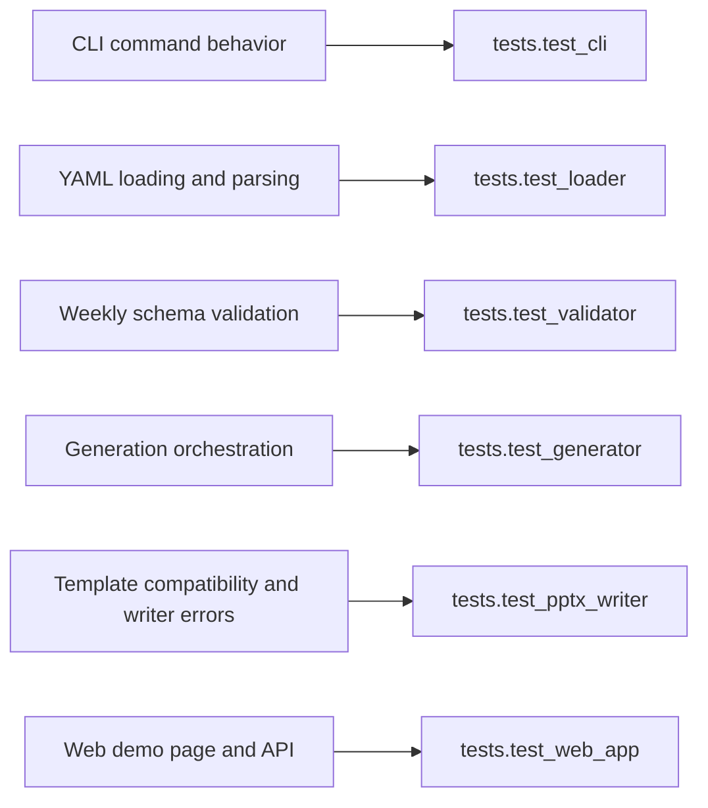

# Feature To Test Map

This map connects user-visible features to the modules and tests that currently lock them down.
Use it to choose the smallest verification target before broadening to more tests.

## Feature map

| Feature | Entry point | Key modules | Main success path | Main failure path | Current tests |
| --- | --- | --- | --- | --- | --- |
| CLI generate command | `autoreport.cli:main` | `autoreport/cli.py`, `autoreport/engine/generator.py` | parse args, generate `.pptx`, print success | map file, YAML, validation, template, and output failures to stderr | `tests.test_cli` |
| YAML loading from disk | CLI | `autoreport/loader.py` | read file and return raw mapping | missing file, unreadable file, invalid YAML | `tests.test_loader` |
| YAML parsing from pasted text | Web API | `autoreport/loader.py`, `autoreport/web/app.py` | parse raw YAML text into mapping | invalid YAML returns `400` | `tests.test_loader`, `tests.test_web_app` |
| Weekly schema validation | Shared core | `autoreport/validator.py`, `autoreport/models.py` | return trimmed `WeeklyReport` | reject unsupported fields, bad lists, bad metrics, non-mapping payloads | `tests.test_validator` |
| Generation orchestration | Shared core | `autoreport/engine/generator.py`, `autoreport/templates/weekly_report.py` | validate, build context, write five slides | reject unsupported template name or downstream failures | `tests.test_generator` |
| Template compatibility and output writing | Shared core | `autoreport/outputs/pptx_writer.py` | load template, clear seed slides, save `.pptx` | missing template, invalid template, read error, compatibility error, write error | `tests.test_pptx_writer`, `tests.test_cli` |
| Web demo HTML and download API | `FastAPI app` | `autoreport/web/app.py` | render homepage, return downloadable PPTX | `400`, `422`, `500` JSON failures | `tests.test_web_app` |

## Inspection points

- Start with the narrowest unittest module that matches the feature you are changing.
- If a change crosses feature boundaries, combine the smallest relevant test modules before running the full suite.
- `tests.test_cli` and `tests.test_web_app` verify user-facing contracts, not just internal behavior.
- `tests.test_generator` and `tests.test_pptx_writer` together describe the generation core.

## Source of truth

- `tests/test_cli.py`
- `tests/test_loader.py`
- `tests/test_validator.py`
- `tests/test_generator.py`
- `tests/test_pptx_writer.py`
- `tests/test_web_app.py`
