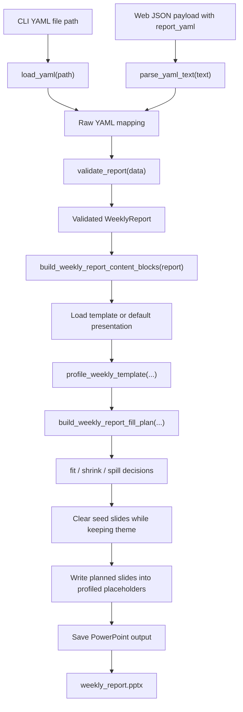

# Generation Flow

This flowchart shows how input changes shape as it moves through the current weekly report pipeline.
It is useful when you need to inspect where a bug belongs: input loading, schema validation, context shaping, or PowerPoint writing.

The pipeline is intentionally narrow.
Only the entry step changes between CLI and web.
After raw data exists, the current flow is shared and deterministic.

## Inspection points

- The validator is the boundary between untrusted input and typed weekly report data.
- The weekly template helper now produces semantic content blocks and a fill plan instead of only a fixed slide-context dict.
- The writer owns template loading, seed-slide removal, and file output.
- Template profiling and fit/spill planning happen before slides are written.
- The current pipeline does not branch by `report_type` or alternate template name.

## Source of truth

- `autoreport/loader.py`
- `autoreport/validator.py`
- `autoreport/templates/weekly_report.py`
- `autoreport/engine/generator.py`
- `autoreport/outputs/pptx_writer.py`
- `tests/test_generator.py`
- `tests/test_pptx_writer.py`
