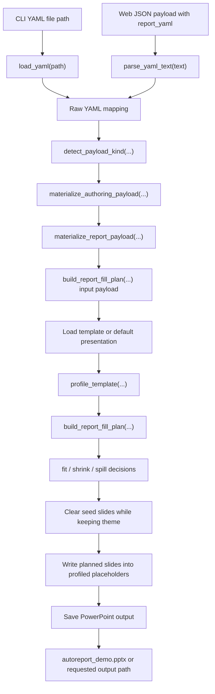

# Generation Flow

This flowchart shows how input changes shape as it moves through the current contract-first generation pipeline.
It is useful when you need to inspect where a bug belongs: input loading, schema validation, context shaping, or PowerPoint writing.

The pipeline is intentionally narrow.
Only the entry step changes between CLI and web.
After raw data exists, the current flow is shared and deterministic.

## Inspection points

- The template-flow layer is the boundary between untrusted raw input and the typed authoring/runtime payloads used for generation.
- The legacy `weekly_report` helper names now sit under the contract-first editorial/manual template flow rather than a weekly-only public contract.
- The writer owns template loading, seed-slide removal, and file output.
- Template profiling and fit/spill planning happen before slides are written.
- The current pipeline branches by payload kind and built-in or uploaded template contract rather than by a separate `report_type` field.

## Source of truth

- `autoreport/loader.py`
- `autoreport/validator.py`
- `autoreport/templates/weekly_report.py`
- `autoreport/engine/generator.py`
- `autoreport/outputs/pptx_writer.py`
- `tests/test_generator.py`
- `tests/test_pptx_writer.py`
