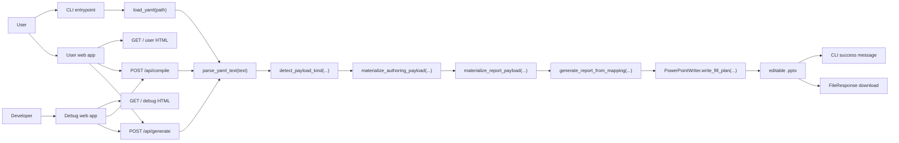

# System Overview

The current `autoreport` core exposes three public entry points:

- the CLI
- the user-facing FastAPI app
- the developer-facing FastAPI debug app

All three converge on the same contract validation and PowerPoint generation
pipeline.

## Inspection points

- The user app and debug app intentionally differ at the HTML layer, not at the route or generation layer.
- `report_content` is the AI-facing draft surface.
- `authoring_payload` is the normalized authoring surface.
- `report_payload` is the compiled runtime surface.
- `POST /api/compile` exists to expose normalization and compilation without generation.
- `POST /api/generate` is shared by CLI-backed validation/generation rules and both web surfaces.

## Source of truth

- `autoreport/cli.py`
- `autoreport/web/app.py`
- `autoreport/web/debug_app.py`
- `autoreport/template_flow.py`
- `autoreport/validator.py`
- `autoreport/engine/generator.py`
- `autoreport/outputs/pptx_writer.py`
- `tests/test_cli.py`
- `tests/test_web_app.py`
- `tests/test_web_debug_app.py`
