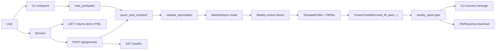

# System Overview

The current `autoreport` core exposes two public entry points.
The CLI reads YAML from disk, while the web demo accepts pasted YAML text.
Both paths converge on the same validation, context-building, and PowerPoint writing flow.

`GET /healthz` belongs to the web surface, but it does not participate in report generation.
The generation core starts after YAML is available as a raw mapping.

## Inspection points

- The CLI and web demo share the same validation and writer path after YAML parsing.
- The CLI uses `load_yaml(path)` and the web demo uses `parse_yaml_text(text)`.
- `validate_report` is the gate between raw input and typed weekly report data.
- The template layer now profiles the current title/body layouts and maps validated data into slots.
- `PowerPointWriter` writes a fill plan into a template or default presentation and saves the output file.

## Source of truth

- `autoreport/cli.py`
- `autoreport/web/app.py`
- `autoreport/loader.py`
- `autoreport/validator.py`
- `autoreport/templates/weekly_report.py`
- `autoreport/engine/generator.py`
- `autoreport/outputs/pptx_writer.py`
