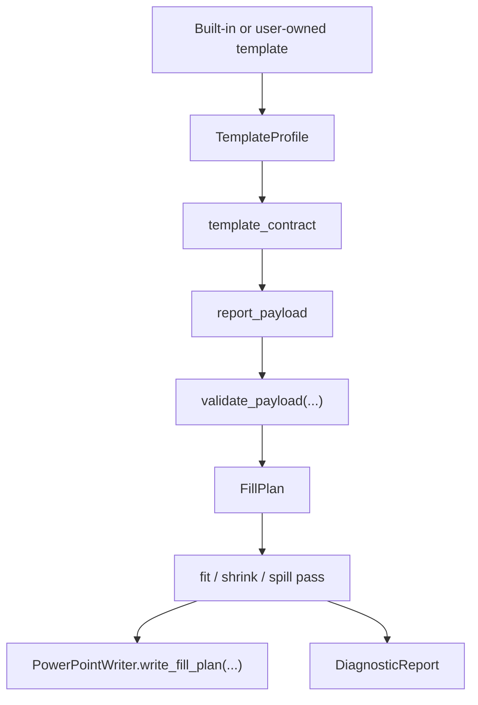

# Template-Aware Autofill Engine

This note describes the current contract-first Autoreport runtime.
The product is no longer framed as a fixed weekly-report generator.
It is a template-aware PPTX autofill engine that exposes template contracts and
accepts structured payloads that another AI can fill directly.

## Product definition

Autoreport now follows this public flow:

1. inspect a template
2. export a machine-readable `template_contract`
3. fill a `report_payload`
4. generate an editable `.pptx`

The template owns layout decisions.
Autoreport owns:

- template profiling
- contract export
- payload validation
- slot mapping
- fit and spill policy
- editable `.pptx` output
- diagnostics for risky layouts

## Current runtime flow

## Core internal types

- `TemplateProfile`: profiled title pattern, contents pattern, and reusable slide patterns
- `PatternProfile`: one reusable generation pattern with ordered slots
- `SlotDescriptor`: slot metadata, geometry, font defaults, ordering, and slot type
- `TemplateContract`: public export model for the inspected template
- `ReportPayload`: public generation payload model
- `FillPlan`: ordered slide plan ready to write into PowerPoint
- `FitResult`: fit, shrink, spill, or overflow outcome for one slot
- `DiagnosticReport`: warnings and errors collected during profiling and fitting

## Built-in editorial template

The built-in public template is `autoreport_editorial`.
It is product-owned, text-first by default, and exposed as a real public
contract rather than an internal fallback.

Current built-in patterns:

- `cover.editorial`
- `contents.editorial`
- `text.editorial`
- `metrics.editorial`
- `text_image.editorial`

The built-in chrome is still authored locally and written at generation time.
Autoreport does not vendor third-party template branding into the runtime path.

## Public contracts

`template_contract`

- `contract_version`
- `template_id`
- `template_label`
- `template_source`
- `title_slide`
- `contents_slide`
- `slide_patterns`

`report_payload`

- `payload_version`
- `template_id`
- `title_slide`
- `contents`
- `slides`

Current first-phase slide kinds:

- `text`
- `metrics`
- `text_image`

`slot_overrides` are supported for exact placeholder-level replacement when the
friendly slide fields are not specific enough.

## Current policies

- Template interpretation is placeholder-first for user-owned `.pptx` files.
- The built-in editorial path is cached and does not re-profile on each web request.
- Slide titles remain the source for `Contents` generation.
- Text still prefers the default font size, then shrinks, then spills onto continuation slides.
- Image handling currently supports explicit `contain` and `cover` fit policies.
- Web v1 supports uploaded image refs such as `image_1`; external template upload in the web surface is deferred.

## What is intentionally out of scope today

- Server-side LLM calls in the generation path
- Arbitrary visual layout invention at generation time
- Every possible `.pptx` edge case
- Public web upload of arbitrary external PowerPoint templates

## Reference posture

Autoreport keeps the Python + `python-pptx` generation path as the runtime
engine. External tools such as `PptxGenJS` or design sandbox worktrees can
inform template authoring, but they are not part of the runtime path here.
