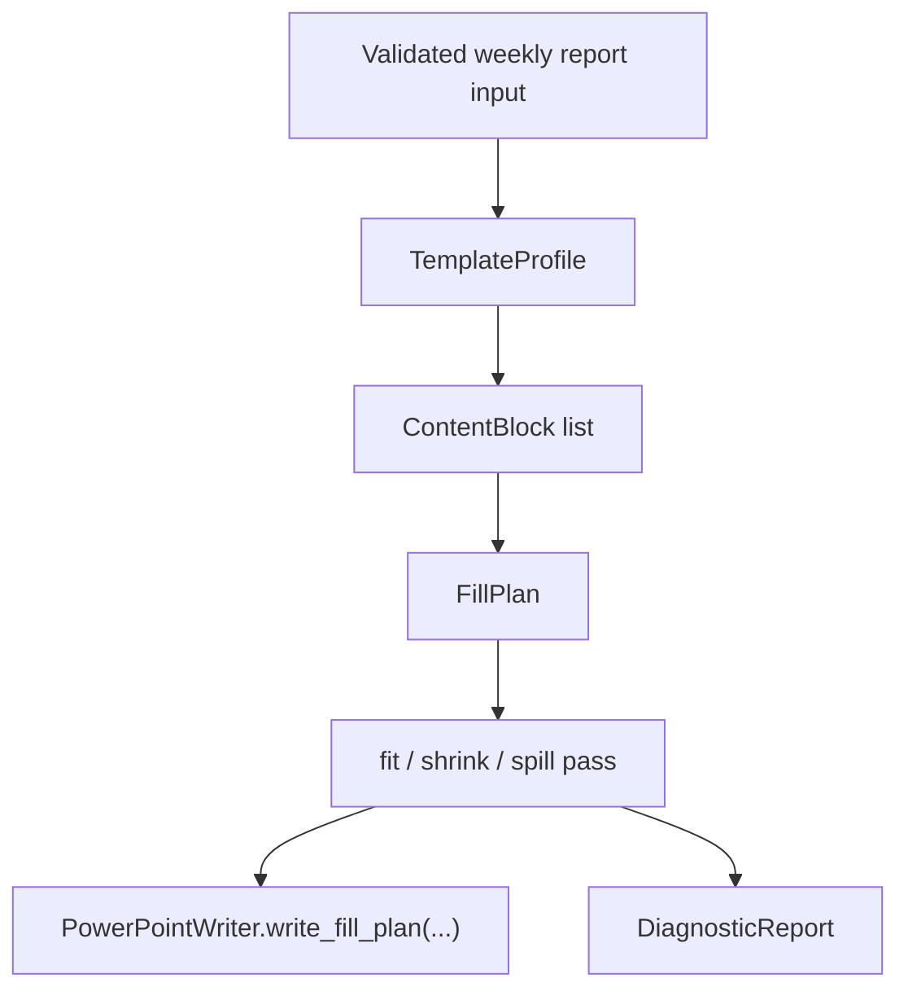

# Template-Aware Autofill Engine

This note describes the near-term `v0.3` direction for `autoreport`.
The goal is not to make an AI slide designer.
The goal is to understand a user-owned PowerPoint template and fill it safely.

## Product definition

Autoreport is evolving from a fixed weekly deck generator into a
template-aware PPTX autofill engine for user-owned PowerPoint templates.

The template owns layout decisions.
Autoreport owns:

- template profiling
- slot mapping
- fit and spill policy
- editable `.pptx` output
- diagnostics for risky layouts

## Current v0.3 scaffold

The generation core now follows this internal order:

### Core internal types

- `TemplateProfile`: title/body layouts plus the current fillable slots
- `SlotDescriptor`: placeholder metadata, geometry, font defaults, and supported content kinds
- `ContentBlock`: semantic content unit such as title, highlights, metrics, risks, or next steps
- `FillPlan`: ordered list of slides ready to be written
- `FitResult`: fit, shrink, spill, or overflow outcome for one slot
- `DiagnosticReport`: warnings and errors collected during profiling and fitting

## Current policies

- Template interpretation is placeholder-first.
- Layout indices still default to the current title/body pair used by the weekly flow.
- The engine tries the preferred font size first, then shrinks down to a minimum.
- If content still does not fit, it spills onto continuation slides.
- If even one item is too large for the minimum budget, the engine still writes it but reports an out-of-bounds risk.
- Font diagnostics are lightweight for now: user-supplied templates without explicit font names are flagged as substitution risk.

## What is intentionally out of scope today

- Arbitrary template mastery for every possible `.pptx`
- Full screenshot/PDF recreation
- JS or `PptxGenJS` migration
- AI-driven layout invention

## `slides` ideas being adopted

The `slides` reference is most useful here as a helper/diagnostics source.
The current scaffold is aligned with these priorities:

1. font fitting and text-box sizing heuristics
2. overflow and out-of-bounds diagnostics
3. render-based visual verification as a future QA layer
4. font substitution diagnostics
5. image contain/crop helpers for later slot types
