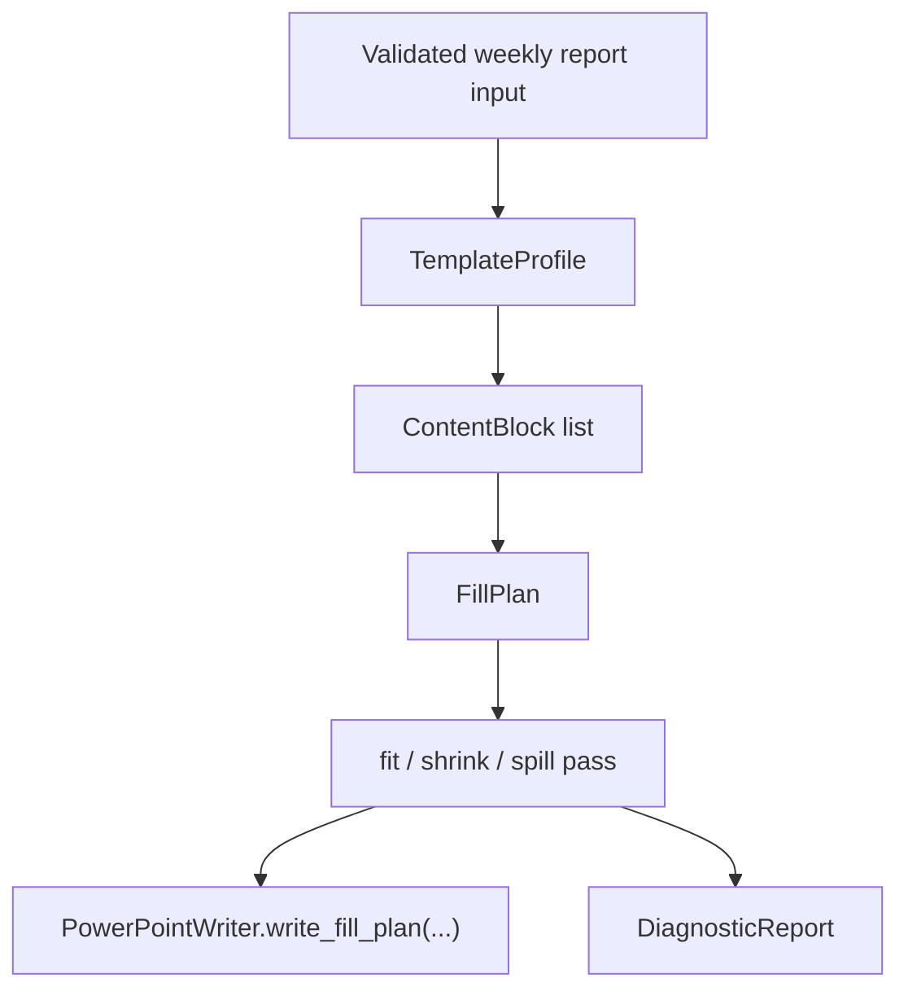

# Template-Aware Autofill Engine

This note describes the near-term `v0.3` direction for `autoreport`.
The goal is not to make an AI slide designer.
The goal is to understand a user-owned PowerPoint template and fill it safely.

## Product definition

Autoreport is evolving from a fixed weekly deck generator into a
template-aware PPTX autofill engine for user-owned PowerPoint templates.

The template owns layout decisions.
Autoreport owns:

- template profiling
- slot mapping
- fit and spill policy
- editable `.pptx` output
- diagnostics for risky layouts

## Current v0.3 scaffold

The generation core now follows this internal order:

### Core internal types

- `TemplateProfile`: title/body layouts plus the current fillable slots
- `SlotDescriptor`: placeholder metadata, geometry, font defaults, and supported content kinds
- `ContentBlock`: semantic content unit such as title, highlights, metrics, risks, or next steps
- `FillPlan`: ordered list of slides ready to be written
- `FitResult`: fit, shrink, spill, or overflow outcome for one slot
- `DiagnosticReport`: warnings and errors collected during profiling and fitting

## Sanitized basic template

`v0.3` now also carries a built-in `basic_template` profile.
It is intentionally neutral and text-first.

- It was derived from a repeated corporate guide structure, not from the branded assets themselves.
- It uses clean text boxes on a blank slide layout instead of reusing the original logo, footer, or decorative shapes.
- If a reference `.pptx` is supplied, the engine copies only the slide size so the generated deck keeps the same aspect ratio without inheriting branding.
- This makes `basic_template` a good bridge profile when a team wants the rough pacing and spacing of an internal deck but needs a sanitized baseline for product work.

## Current policies

- Template interpretation is placeholder-first.
- For `weekly_report`, the engine now searches the supplied template for a compatible title layout and body layout instead of assuming fixed layout indices.
- Title slides may be profiled from title-like text placeholders even when the template does not use PowerPoint's `TITLE` placeholder type on the opening slide.
- The engine tries the preferred font size first, then shrinks down to a minimum.
- If content still does not fit, it spills onto continuation slides.
- If even one item is too large for the minimum budget, the engine still writes it but reports an out-of-bounds risk.
- Font diagnostics are lightweight for now: user-supplied templates without explicit font names are flagged as substitution risk.

## What is intentionally out of scope today

- Arbitrary template mastery for every possible `.pptx`
- Full screenshot/PDF recreation
- JS or `PptxGenJS` migration
- AI-driven layout invention

## `slides` ideas being adopted

The `slides` reference is most useful here as a helper/diagnostics source.
The current scaffold is aligned with these priorities:

1. font fitting and text-box sizing heuristics
2. overflow and out-of-bounds diagnostics
3. render-based visual verification as a future QA layer
4. font substitution diagnostics
5. image contain/crop helpers for later slot types

## Reference posture and licensing

`slides` is treated as a design reference, not as a runtime dependency or a code
bundle inside `autoreport`.

- `autoreport` keeps the Python + `python-pptx` generation path as the product engine.
- Helper logic in `autoreport/templates/autofill.py` is reimplemented locally for this repository instead of copying `slides` or `PptxGenJS` source into the runtime path.
- The current fit/spill heuristics are intentionally clean-room style estimates based on this repo's slot model, tests, and PowerPoint constraints.
- If a future task ever requires direct code import or vendoring from `slides`, that should be handled as a separate licensing task with explicit Apache-2.0 attribution and review.

This keeps the current `v0.3` path aligned with the product goal:
template-aware autofill for user-owned `.pptx` templates, not a JS deck-authoring stack swap.

## Parallel delivery plan

For branch names, ownership boundaries, and per-thread done criteria, see
`v0.3-template-workstreams.md`.
