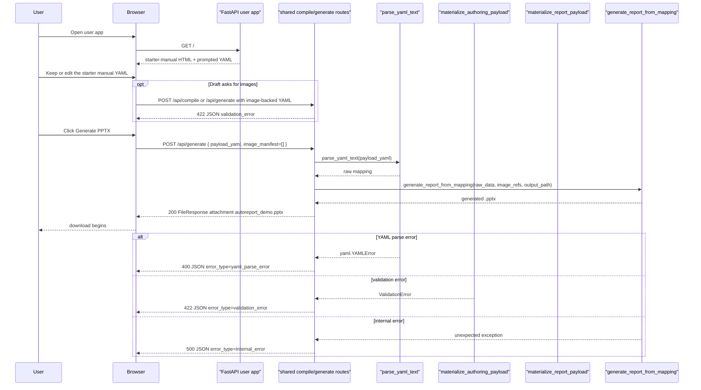

# Web Demo Sequence

This diagram focuses on the current web flow.
It shows the user-facing app path first and then the shared compile/generate
behavior reused by the developer-facing debug app.

The debug app still reuses the same `/api/compile` and `/api/generate` logic.
Its difference is the HTML surface plus a public-app guardrail: the default user
app rejects image-backed drafts, while the debug app remains the place where
compile/runtime inspection and upload-backed testing stay explicit.

## Inspection points

- `GET /` in `autoreport/web/app.py` is the simplified starter-manual user flow.
- `GET /` in `autoreport/web/debug_app.py` is the developer-facing inspection flow.
- `POST /api/compile` accepts multipart form data, not raw JSON, and is primarily surfaced by the debug app.
- `POST /api/generate` also accepts multipart form data and returns a download.
- The public app path now keeps `image_manifest` empty and rejects image-backed payloads.
- Temporary files are cleaned up after requests complete.

## Source of truth

- `autoreport/web/app.py`
- `autoreport/web/debug_app.py`
- `autoreport/template_flow.py`
- `autoreport/engine/generator.py`
- `tests/test_web_app.py`
- `tests/test_web_debug_app.py`
