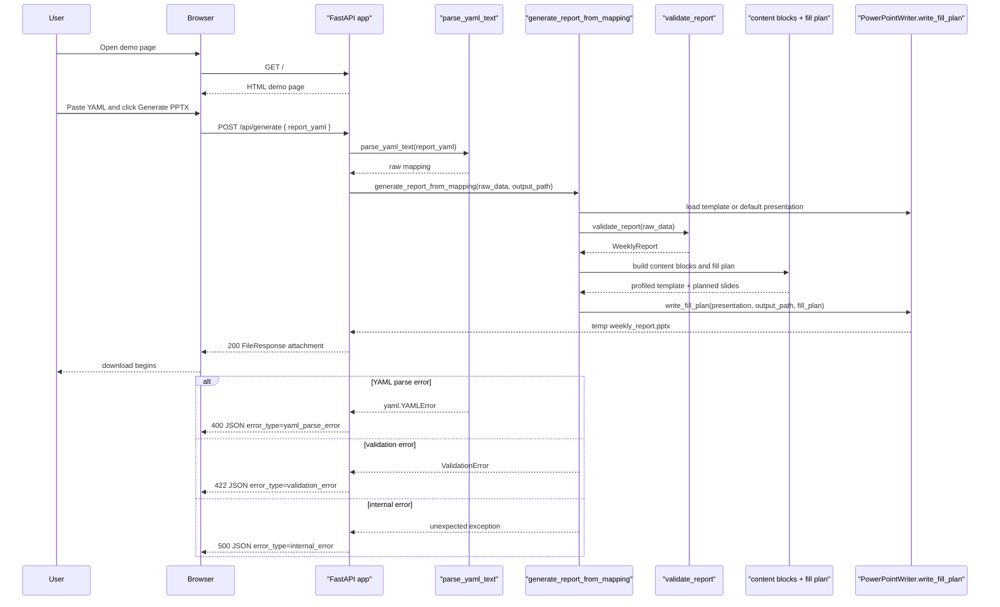

# Web Demo Sequence

This diagram focuses on the current public demo generation path.
It shows both the initial page load and the `POST /api/generate` request that actually produces the download.

The web demo creates a temporary output directory for each request and cleans it up after the file response is sent.
It does not persist the submitted YAML as part of the request flow.

## Inspection points

- `GET /` serves a single-page HTML demo with tested literal UI copy.
- `GET /healthz` is a deployment check endpoint and not part of the generation sequence.
- `POST /api/generate` accepts JSON with one field, `report_yaml`.
- The web demo reuses the same generator core as the CLI after YAML becomes a mapping.
- The web surface returns HTTP status codes instead of CLI exit codes.

## Source of truth

- `autoreport/web/app.py`
- `autoreport/loader.py`
- `autoreport/engine/generator.py`
- `tests/test_web_app.py`
