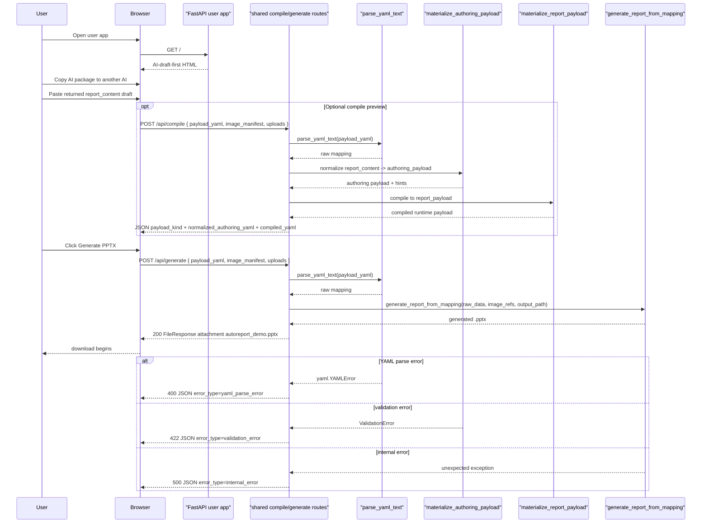

# Web Demo Sequence

This diagram focuses on the current web flow.
It shows the user-facing app path first and then the shared compile/generate
behavior reused by the developer-facing debug app.

The debug app reuses the same `/api/compile` and `/api/generate` logic.
Its difference is the HTML surface, not the execution path.

## Inspection points

- `GET /` in `autoreport/web/app.py` is the simplified user-facing flow.
- `GET /` in `autoreport/web/debug_app.py` is the developer-facing inspection flow.
- `POST /api/compile` accepts multipart form data, not raw JSON.
- `POST /api/generate` also accepts multipart form data and returns a download.
- Temporary files are cleaned up after requests complete.

## Source of truth

- `autoreport/web/app.py`
- `autoreport/web/debug_app.py`
- `autoreport/template_flow.py`
- `autoreport/engine/generator.py`
- `tests/test_web_app.py`
- `tests/test_web_debug_app.py`
