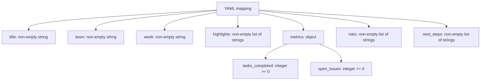

# Weekly Report Contract

This document summarizes the current accepted weekly report payload.
It is intentionally small and test-oriented, so it can be used as a checklist when inspecting feature-level behavior.

## Required fields

| Field | Rule |
| --- | --- |
| `title` | required, trimmed, non-empty string |
| `team` | required, trimmed, non-empty string |
| `week` | required, trimmed, non-empty string |
| `highlights` | required, at least one non-empty string item |
| `metrics` | required object |
| `risks` | required, at least one non-empty string item |
| `next_steps` | required, at least one non-empty string item |

## Metrics object

| Field | Rule |
| --- | --- |
| `tasks_completed` | required integer, not `bool`, `>= 0` |
| `open_issues` | required integer, not `bool`, `>= 0` |

No other metric keys are accepted.

## Current limits

- Only the weekly report shape is supported.
- Additional top-level fields are rejected.
- `report_type` is explicitly rejected.
- The literal validation error still says `Field 'report_type' is not supported in v0.1.` because that exact string is part of the tested contract.
- The weekly flow still starts with title, highlights, metrics, risks, and next steps, but long sections may spill into continuation slides.

## Inspection points

- Validation trims accepted strings before building the `WeeklyReport` model.
- Validation collects multiple errors before raising `ValidationError`.
- The contract is enforced before any template or PowerPoint work begins.
- Example input lives in `examples/weekly_report.yaml`.

## Source of truth

- `examples/weekly_report.yaml`
- `autoreport/validator.py`
- `autoreport/models.py`
- `autoreport/templates/weekly_report.py`
- `tests/test_validator.py`
