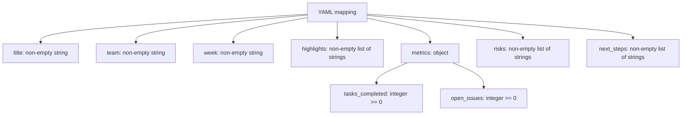

# Weekly Report Legacy Note

This document is a legacy migration note for the older weekly-only payload shape.
It is not the current public Autoreport contract.
Keep it only as a reminder of why some internal module names still mention `weekly_report`.

## Historical weekly fields

| Field | Rule |
| --- | --- |
| `title` | required, trimmed, non-empty string |
| `team` | required, trimmed, non-empty string |
| `week` | required, trimmed, non-empty string |
| `highlights` | required, at least one non-empty string item |
| `metrics` | required object |
| `risks` | required, at least one non-empty string item |
| `next_steps` | required, at least one non-empty string item |

## Historical metrics object

| Field | Rule |
| --- | --- |
| `tasks_completed` | required integer, not `bool`, `>= 0` |
| `open_issues` | required integer, not `bool`, `>= 0` |

No other metric keys are accepted.

## Current status

- The current public contract-first runtime is described by `template_contract`, `report_content`, `authoring_payload`, and `report_payload`.
- This weekly-only shape is no longer the public source of truth for validation or generation behavior.
- Internal compatibility helpers and file names may still mention `weekly_report`, but contributor guidance should not describe this as the live product contract.

## Inspection points

- Use this note only when an internal helper name or historical document still references the weekly-era model.
- Current behavior claims should instead cite `README.md`, `autoreport/template_flow.py`, `autoreport/validator.py`, and the matching current tests.

## Historical source anchors

- `autoreport/validator.py`
- `autoreport/models.py`
- `autoreport/templates/weekly_report.py`
- git history for the pre-contract-first weekly payload era
