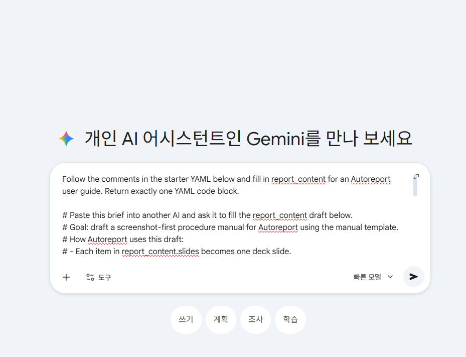
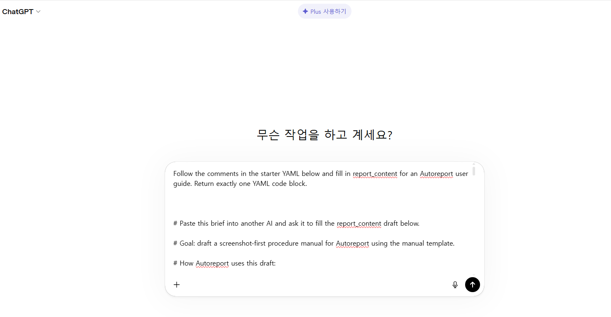
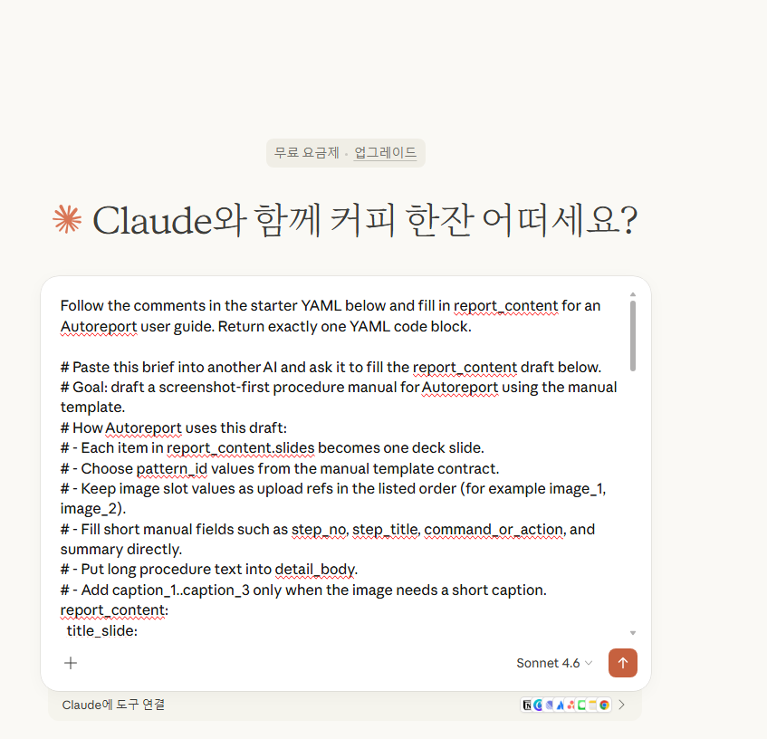

# User Guide

Current version: `v0.3.1`

This guide reflects the current implementation of Autoreport on the active branch. Autoreport is a template-contract-first PPTX generation engine: it inspects a PowerPoint template, exposes a fillable contract, accepts `report_content` or `authoring_payload`, compiles a runtime `report_payload`, and generates an editable PowerPoint deck. The same core path powers the CLI, the public web demo, and the separate debug app.

For version-specific changes, see the release notes.

## Live service

As of `2026-04-04`, the public release pages and the hosted demo app are available at:

- Release-facing site home: `http://auto-report.org/`
- Release-facing user guide: `http://auto-report.org/guide/`
- Release-facing updates hub: `http://auto-report.org/%EC%97%85%EB%8D%B0%EC%9D%B4%ED%8A%B8/`
- Hosted demo app: `http://3.36.96.47/`
- Alternate EC2 hostname: `http://ec2-3-36-96-47.ap-northeast-2.compute.amazonaws.com/`
- Hosted demo health check: `http://3.36.96.47/healthz` returns `{"status":"ok"}`

## What is Autoreport?

Autoreport is a deterministic PowerPoint generation tool for teams that want repeatable deck output without rebuilding layouts by hand. Instead of letting slide structure drift from run to run, you start from a template contract, fill the supported draft surface, and generate a `.pptx` through one validated runtime path.

## What the current version can do

- Inspect the built-in editorial template or a user-owned `.pptx` template through the CLI
- Export a machine-readable `template_contract`
- Scaffold a starter `authoring_payload` from that contract
- Accept `report_content`, `authoring_payload`, or a compiled `report_payload`
- Compile authoring inputs into a runtime payload for debugging
- Generate an editable `.pptx` deterministically through Python and `python-pptx`
- Start from the built-in manual procedure starter in the public web demo
- Refresh aligned screenshot upload panels beside the matching slide previews
- Upload screenshots for each image-bearing manual slide in the hosted public flow
- Download `autoreport_demo.pptx` directly after successful generation
- Keep image-backed drafts and upload-based inspection in the separate debug app or the CLI

## Public pages and routes

When this guide is handed off through `autorelease`, the publishing flow is organized around three stable reader routes:

- `Home`: `http://auto-report.org/`
- `User Guide`: `http://auto-report.org/guide/`
- `Updates`: `http://auto-report.org/%EC%97%85%EB%8D%B0%EC%9D%B4%ED%8A%B8/`

The guide route is updated in place, while release notes and development logs are grouped under the Updates page. These release-facing WordPress pages are separate from the currently hosted demo app.

## Basic usage

Autoreport currently supports Python `3.10+`.

### CLI

Use the CLI when you want to inspect a contract, scaffold a payload, compile the runtime payload, or generate a deck from disk-backed files.

```bash
autoreport inspect-template --built-in autoreport_editorial --output output/template_contract.yaml
autoreport scaffold-payload output/template_contract.yaml --output output/authoring_payload.yaml
autoreport compile-payload output/authoring_payload.yaml --output output/report_payload.yaml
autoreport generate output/authoring_payload.yaml --output output/autoreport_demo.pptx
```

When you want to work against a user-owned template instead of the built-in editorial baseline, pass `--template path/to/template.pptx` to `inspect-template` or `generate`.

### Homepage / web demo

Use the web demo when you want the built-in manual procedure starter in the browser.

```bash
python -m autoreport.web.serve public --host 0.0.0.0 --port 8000
```

After starting the server, open the homepage. The main editor already includes the AI prompt comments plus the built-in manual procedure starter. The public page keeps the screenshot-first manual flow visible: use `Refresh Slide Assets` to build the paired preview rows, upload one screenshot for each listed image slot, and then generate the deck. The built-in flow keeps each upload panel aligned with the exact PowerPoint slide preview that needs that screenshot.

On the current branch, the success state changes to `Generation complete. Your Autoreport deck download should begin shortly.` and the file is downloaded as `autoreport_demo.pptx`.

### Drafting with another AI

If you want another AI to draft the `report_content` block first, copy the full starter YAML with the comment lines still attached and paste that block into the provider of your choice. The same starter brief is already documented here with stable insert examples for Gemini, ChatGPT, and Claude.

Gemini insert example:



ChatGPT insert example:



Claude insert example:



These screenshots document the insert step only. They are fixed guide assets rather than release-verification captures, so the guide can keep reusing the same provider examples across versions.

### Debug app

Use the debug app when you need contract inspection, normalization details, compiled runtime output, or image-backed drafts without cluttering the user-facing page.

```bash
python -m autoreport.web.serve debug --host 0.0.0.0 --port 8010
```

## Sample generated PPTX and browser capture

The public sample deck is not attached yet, but the current output contract is stable:

- Local output filename: `autoreport_demo.pptx`
- Public sample output: hosted download link coming soon
- Fastest check: generate from the homepage or CLI and open the resulting `.pptx` locally

Before publishing this guide, upload the working screenshot to WordPress Media and replace the placeholder URL below.


<!-- Local working screenshot asset: docs/posts/guide-image-v0.3.1/image.png -->

## Verification on the current branch

The current branch was verified with the public-web, debug-web, handoff-facing, and browser-evidence checks.

- `.\venv\Scripts\python.exe -m unittest tests.test_web_app tests.test_web_debug_app tests.test_autorelease_handoff tests.test_public_web_playwright` passed
- `.\\venv\\Scripts\\python.exe tests\\e2e\\run_public_web_playwright.py --version 0.3.1 --promote-guide-image` is the repeatable browser evidence command for the current manual public flow
- The public homepage opens with the built-in manual procedure starter, aligned upload panels, and PowerPoint slide previews
- The browser-facing manual flow accepts the six screenshot uploads from the built-in starter and downloads `autoreport_demo.pptx`
- The debug app keeps compiled payload inspection and image-backed drafts available

## Supported input structure

The current product accepts three public input surfaces:

- `report_content`: AI-facing draft content keyed by `pattern_id` and slot names
- `authoring_payload`: normalized public authoring contract
- `report_payload`: compiled runtime generation payload

For template inspection, the exported `template_contract` remains the source of truth for allowed `pattern_id` values, slot names, and image capacity. The hosted public web demo keeps the image-backed path limited to the built-in manual starter with upload refs, while broader image-backed authoring stays in the debug app and CLI.

## Current limitations

- Arbitrary PowerPoint template upload is still a CLI-only path
- The public web demo does not expose debug panes, arbitrary template upload, or the broader debug-only image authoring workflow
- Generation remains deterministic and local; there is no server-side LLM call in the runtime path
- Final WordPress publication still happens from the private `autorelease` repository after handoff validation

Autoreport `v0.3.1` keeps the same contract-first product line as `v0.3.0` while tightening the public homepage boundary and the release-facing documentation around it.
